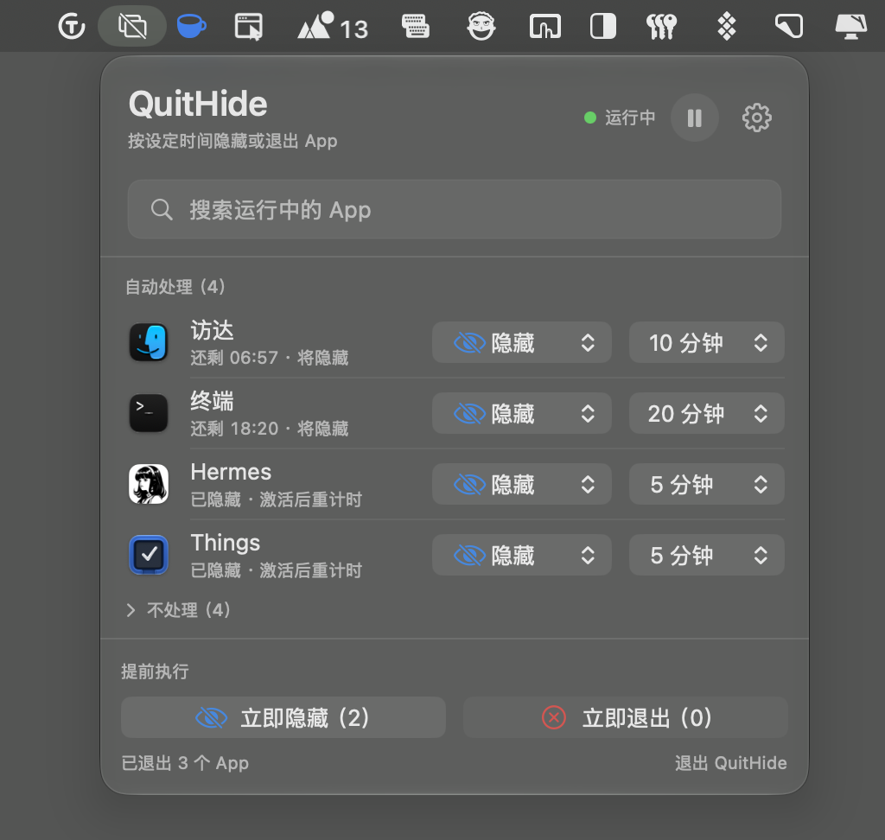

# QuitHide

[中文](README.md)

QuitHide is a native macOS menu bar utility that automatically hides or gracefully quits apps after they have stayed in the background for a configurable amount of time.



## Features

- Choose Hide, Quit, or Ignore independently for each running app
- Set a separate delay for every automated rule
- See the remaining time and next action for each app
- Start a fresh countdown after an app becomes active again
- Hide or quit all matching apps immediately
- Pause automation at any time
- Optionally launch at login
- Leave every app unconfigured by default, so nothing is automated on first launch

## Requirements

- macOS 13 Ventura or later
- Apple Silicon or Intel Mac (Universal 2)

## Download and installation

1. Download the latest `.dmg` from [GitHub Releases](https://github.com/1551255004/QuitHide/releases).
2. Open the DMG and drag `QuitHide.app` into Applications.
3. Launch QuitHide and use its menu bar icon to configure app rules.

The current beta is not yet signed and notarized with an Apple Developer ID. If macOS blocks the first launch, review it under System Settings → Privacy & Security and choose Open Anyway. Only install builds downloaded from this repository's Releases page.

## How it works

Choose an action and delay beside each app. Rules and delays are stored independently. The default delay in Settings applies only when creating a new rule.

The immediate Hide and Quit buttons run matching rules early without changing them. Manual actions remain available while automation is paused.

Quit sends the standard macOS termination request rather than force-killing a process. Each target app remains responsible for warning about unsaved work.

## Privacy

QuitHide runs locally. It contains no network requests, analytics services, or third-party dependencies, and it does not upload running-app information or saved rules.

## Build from source

The Apple Swift toolchain is required. Build the Universal 2 app with:

```sh
./scripts/build-app.sh
```

Create the DMG and its SHA-256 checksum for GitHub Releases with:

```sh
./scripts/build-dmg.sh
```

Artifacts are written to `dist/`.

## License

[MIT License](LICENSE)
