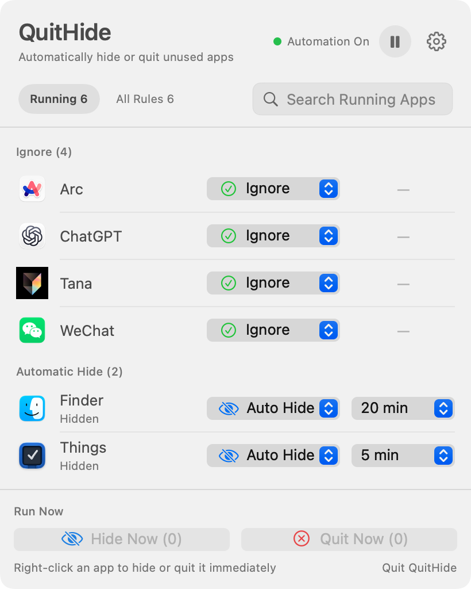

# QuitHide

[简体中文](README.md) · **English**

**Automatically hide or quit Mac apps you are not using.**

QuitHide is a free, open-source macOS menu bar utility. Give each app its own rule and delay: automatically hide it, request a normal quit, or leave it alone after it stays in the background.

For people looking for an alternative to [Quitter](https://marco.org/apps#quitter) or [QuitAll](https://amicoapps.com/app/quitall/), QuitHide offers a clear running-app view, persistent per-app rules, and quick manual actions.

[**Download the latest release**](https://github.com/jiangsir-tech/QuitHide/releases/latest) · [View all releases](https://github.com/jiangsir-tech/QuitHide/releases)

macOS 13 Ventura or later · Apple Silicon and Intel Macs · English and Simplified Chinese interface

<picture>
  <source media="(prefers-color-scheme: dark)" srcset="assets/quithide-menu-en-dark.png">
  
</picture>

## What it does

- Set Automatic Hide, Automatic Quit, or Ignore for each app, with an independent delay.
- Use **Running** for current apps and **All Rules** to manage saved rules while apps are offline.
- See countdowns and upcoming actions; run matching rules early or right-click one app for an immediate action.
- Pause automation at any time, optionally launch at login, and receive stable-release update reminders.
- Opt into two additional rules: auto-hide apps without a rule, and hide Automatic Quit apps before quitting them.
- Opt into window protection: protect Stage Manager groups while it is on, or visible automatic-rule apps while it is off.

| Rule | Behavior |
| --- | --- |
| **Ignore** | QuitHide never automatically hides or quits the app. |
| **Unconfigured** | Left alone by default, or inherits optional automatic hiding. |
| **Automatic Hide** | Hides the app after its delay while leaving it running. |
| **Automatic Quit** | Sends the standard macOS quit request after its delay. |

## Quick start

1. Download the DMG from [Releases](https://github.com/jiangsir-tech/QuitHide/releases/latest), drag `QuitHide.app` into **Applications**, and launch it.
2. Click the QuitHide menu bar icon and find an app under **Running**.
3. Choose a rule and delay. Use the footer buttons or an app's right-click menu for one-off actions.

The **Additional Rules** and both window-protection options are off on a fresh installation, so apps without an explicit rule are not automated and QuitHide does not proactively request Accessibility access. That permission is requested only if Stage Manager group protection is enabled.

## Safety and privacy

- Automatic Quit uses the standard macOS quit request and **never force-quits automatically**. Manual Force Quit is available only from an app's right-click menu and requires confirmation.
- QuitHide manages standard macOS GUI apps. Menu bar-only apps, background processes, and command-line tools may not appear.
- Rules and settings stay on this Mac. QuitHide contains no analytics service and does not upload the running-app list.
- Visible-window protection reads only window positions and frames, never screen contents. Stage Manager group protection uses Accessibility only after you enable it.
- The current stable release is Developer ID signed and notarized by Apple.

## Feedback

[Report a bug or request a feature](https://github.com/jiangsir-tech/QuitHide/issues) · Author: [江sir爱数码](https://github.com/jiangsir-tech)

<details>
<summary>Build from source</summary>

Requires macOS and an Apple Swift 6 toolchain:

```sh
./scripts/test.sh
./scripts/build-app.sh
```

The local build is an ad-hoc-signed Universal 2 app. Formal releases additionally require Developer ID signing and Apple notarization.

</details>

## License

[MIT License](LICENSE)
