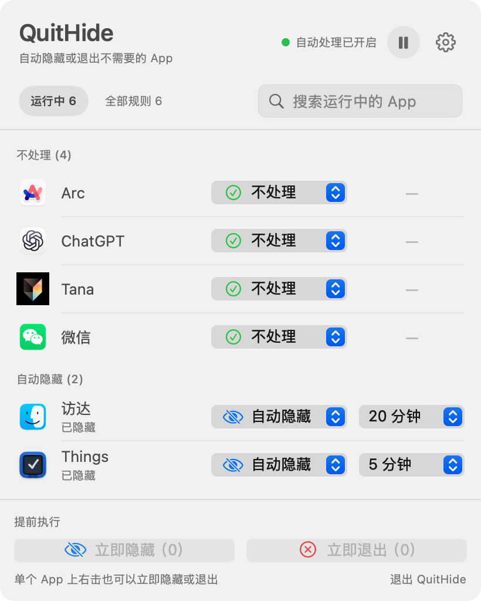

# QuitHide

**简体中文** · [English](README.en.md)

**自动隐藏或退出暂时不用的 Mac App。**

QuitHide 是一款免费、开源的 macOS 菜单栏工具。你可以为每个 App 设置独立规则和等待时间：离开前台一段时间后自动隐藏、正常退出，或者完全不处理。

如果你正在寻找 [Quitter](https://marco.org/apps#quitter) 或 [QuitAll](https://amicoapps.com/app/quitall/) 的同类工具，QuitHide 提供按 App 管理的运行中列表、持久规则和手动快捷操作。

[**下载最新版**](https://github.com/jiangsir-tech/QuitHide/releases/latest) · [查看全部版本](https://github.com/jiangsir-tech/QuitHide/releases)

macOS 13 Ventura 或更高版本 · 支持 Apple Silicon 与 Intel Mac · 简体中文与 English 界面

<picture>
  <source media="(prefers-color-scheme: dark)" srcset="assets/quithide-menu-zh-Hans-dark.png">
  
</picture>

## 主要功能

- 为每个 App 单独设置自动隐藏、自动退出或不处理，并使用独立等待时间。
- “运行中”快速处理当前 App，“全部规则”管理未运行时仍保留的规则。
- 查看倒计时和下一步动作；支持批量执行，也可右击单个 App 立即隐藏或退出。
- 随时暂停自动处理，可选登录时启动，并提供稳定版更新提醒。
- 两项附加规则均由用户自行开启：未设置规则的 App 自动隐藏，以及自动退出前先隐藏。
- 可选窗口保护：台前调度开启时保护分组，关闭时保护屏幕上仍可见的自动规则 App。

| 规则 | 行为 |
| --- | --- |
| **不处理** | QuitHide 不会自动隐藏或退出该 App。 |
| **未设置** | 默认不处理；开启附加规则后可继承自动隐藏。 |
| **自动隐藏** | 达到等待时间后隐藏窗口，App 继续运行。 |
| **自动退出** | 达到等待时间后发送 macOS 正常退出请求。 |

## 快速开始

1. 从 [Releases](https://github.com/jiangsir-tech/QuitHide/releases/latest) 下载 DMG，把 `QuitHide.app` 拖入“应用程序”并启动。
2. 点击菜单栏中的 QuitHide 图标，在“运行中”找到需要设置的 App。
3. 选择规则和等待时间；需要临时处理时，可以使用底部按钮或右键菜单。

新用户的“附加规则”和两项窗口保护默认关闭，因此未设置规则的 App 不会被自动处理，也不会主动请求辅助功能权限。只有用户开启台前调度分组保护时，QuitHide 才会申请该权限。

## 安全与隐私

- 自动退出使用 macOS 正常退出请求，**绝不会自动强制退出**；手动强制退出需要右击 App 并再次确认。
- QuitHide 只管理标准 macOS 图形界面 App；纯菜单栏 App、后台进程和命令行程序可能不会显示。
- 规则和设置保存在本机，不包含分析服务，也不会上传正在运行的 App 列表。
- 屏幕可见保护只读取窗口位置和外框，不读取屏幕内容；台前调度分组保护仅在用户开启后使用辅助功能读取分组。
- 当前稳定版安装包使用 Developer ID 签名并通过 Apple 公证。

## 反馈

[提交问题或建议](https://github.com/jiangsir-tech/QuitHide/issues) · 作者：[江sir爱数码](https://github.com/jiangsir-tech)

<details>
<summary>从源码构建</summary>

需要 macOS 与 Apple Swift 6 工具链：

```sh
./scripts/test.sh
./scripts/build-app.sh
```

本地构建生成 ad-hoc 签名的 Universal 2 App；正式发布还需要 Developer ID 签名与 Apple 公证。

</details>

## 许可证

[MIT License](LICENSE)
